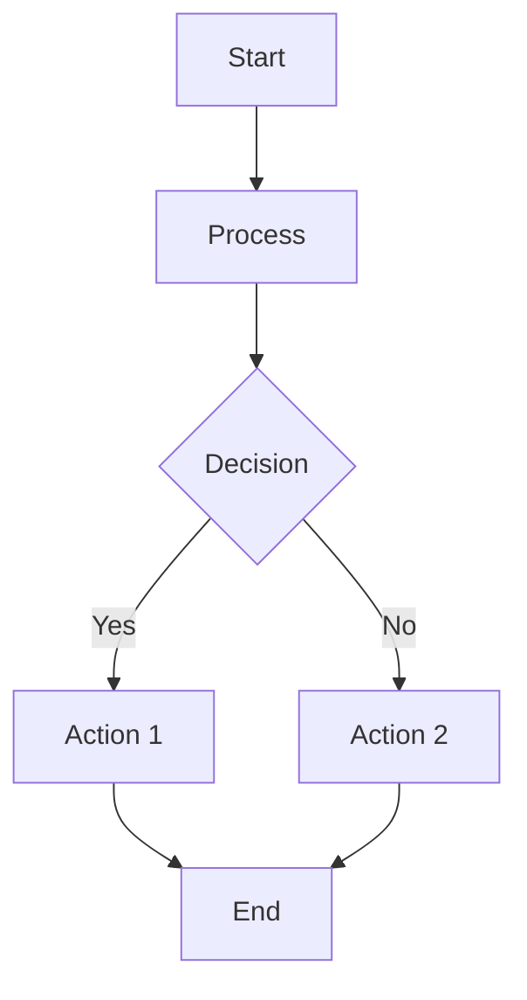

# BlockNote Markdown Editor

A VS Code extension that provides an enhanced markdown editing and preview experience using the BlockNote rich text editor library.

## Features

- Rich text editing for markdown files using BlockNote
- **Mermaid diagram support** - Create and edit flowcharts, sequence diagrams, and more
- Toggle between rich editor and markdown text view
- Custom editor provider that integrates with VS Code
- Context menu integration for markdown files
- Real-time preview capabilities
- Modern TypeScript and React-based architecture

### Mermaid Diagrams

The extension now supports Mermaid diagrams! You can:

1. **Insert diagrams**: Click the 📊 button in rich view or use the built-in block insertion
2. **Edit existing diagrams**: Click the "Edit" button on any mermaid chart
3. **View in text mode**: Mermaid code blocks are preserved as standard markdown code blocks with `language-mermaid` class

**Supported diagram types:**
- Flowcharts
- Sequence diagrams  
- Class diagrams
- State diagrams
- Entity relationship diagrams
- User journey diagrams
- Gantt charts
- Pie charts
- Git graphs

**Example usage:**


## Usage

### Opening Files

1. **Right-click** any `.md` file in the explorer → "Open with BlockNote"
2. **Use the command palette** (`Ctrl+Shift+P` / `Cmd+Shift+P`) → "Open with BlockNote"
3. **Set as default** via the `blocknote-markdown-editor.autoOpenBlockNote` setting

### View Modes

- **Rich View** (📝): WYSIWYG editing with BlockNote
- **Text View** (⟨/⟩): Raw markdown editing with syntax highlighting
### View Modes

- **Rich View** (📝): WYSIWYG editing with BlockNote
- **Text View** (⟨/⟩): Raw markdown editing with syntax highlighting
- **Toggle**: Use `Ctrl+Shift+V` / `Cmd+Shift+V` or click the toggle button

### Keyboard Shortcuts

- `Ctrl+Shift+V` / `Cmd+Shift+V`: Toggle between rich and text view
- `Ctrl+Shift+M` / `Cmd+Shift+M`: Insert Mermaid diagram (rich view only)
- `Ctrl+Shift+B` / `Cmd+Shift+B`: Toggle between BlockNote and default editor
- `Ctrl+Alt+N` / `Cmd+Alt+N`: Create new BlockNote markdown file

### Mermaid Diagrams

1. **Insert new diagram**: 
   - Click the 📊 button in the toolbar (rich view only)
   - Use keyboard shortcut: `Ctrl+Shift+M` / `Cmd+Shift+M`
   - A default flowchart will be inserted
2. **Edit diagram**: Click the "Edit" button on any mermaid block
3. **Convert from markdown**: Existing `\`\`\`mermaid` code blocks are automatically converted to interactive diagrams

## Installation

### From VSIX Package

1. Download the latest `.vsix` file from the releases
2. Install using VS Code command palette: `Extensions: Install from VSIX...`
3. Select the downloaded `.vsix` file

### Development Installation

```bash
# Clone the repository
git clone https://github.com/jerfletcher/blocknote-preview.git
cd blocknote-preview

# Install dependencies
npm install

# Build and install the extension
npm run vsix:install
```

## Development

### Prerequisites

- Node.js (v20 or later)
- npm
- VS Code

### Setup

```bash
# Install dependencies
npm install
```

### Building

The project includes several build scripts for different scenarios:

#### Development Build
```bash
# One-time build for development
npm run build:dev

# Or simply
npm run build
```

#### Production Build
```bash
# Build optimized version for production
npm run build:prod
```

#### Watch Mode (Recommended for Development)
```bash
# Start watch mode for active development
npm run dev

# Or
npm run watch
```

This will start both TypeScript type checking and esbuild in watch mode, automatically rebuilding when files change.

#### Package as VSIX
```bash
# Create a .vsix package file (auto-increments patch version)
npm run vsix:package

# Version-specific packaging
npm run vsix:package:patch  # 0.0.x
npm run vsix:package:minor  # 0.x.0
npm run vsix:package:major  # x.0.0

# Build and install in VS Code Insiders (auto-increments patch version)
npm run vsix:install

# Version-specific install commands
npm run vsix:install:patch  # Increment patch (0.0.x) and install
npm run vsix:install:minor  # Increment minor (0.x.0) and install  
npm run vsix:install:major  # Increment major (x.0.0) and install

# Build and install in VS Code Stable
npm run vsix:install:stable

# Build and install in VS Code Insiders (explicit)
npm run vsix:install:insiders

# Auto-detect VS Code version and install
npm run vsix:install:auto

# Manual version control (without packaging)
npm run version:patch   # 0.0.x
npm run version:minor   # 0.x.0  
npm run version:major   # x.0.0
```

**Examples:**
```bash
# Install with minor version bump (0.0.31 → 0.1.0)
npm run vsix:install:minor

# Install with major version bump (0.1.0 → 1.0.0)  
npm run vsix:install:major

# Default install (patch bump: 1.0.0 → 1.0.1)
npm run vsix:install
```

**Note**: The default `vsix:install` command is configured for VS Code Insiders. All install commands automatically increment the patch version to ensure VS Code picks up changes.

### Available NPM Scripts

| Script | Description |
|--------|-------------|
| `npm run build` | Standard development build |
| `npm run build:dev` | Development build with source maps |
| `npm run build:prod` | Production build (optimized) |
| `npm run dev` | Start development with watch mode |
| `npm run watch` | Watch for changes and rebuild |
| `npm run package` | Create production bundle |
| `npm run vsix:package` | Auto-increment patch version and package as VSIX |
| `npm run vsix:package:patch` | Increment patch (0.0.x) and package as VSIX |
| `npm run vsix:package:minor` | Increment minor (0.x.0) and package as VSIX |
| `npm run vsix:package:major` | Increment major (x.0.0) and package as VSIX |
| `npm run vsix:install` | Auto-increment patch, build and install extension |
| `npm run vsix:install:patch` | Increment patch, build and install |
| `npm run vsix:install:minor` | Increment minor, build and install |
| `npm run vsix:install:major` | Increment major, build and install |
| `npm run version:patch` | Manually increment patch version (0.0.x) |
| `npm run version:minor` | Manually increment minor version (0.x.0) |
| `npm run version:major` | Manually increment major version (x.0.0) |
| `npm run clean:vsix` | Remove all VSIX files |
| `npm run lint` | Run ESLint |
| `npm run lint:fix` | Run ESLint and fix auto-fixable issues |
| `npm run check-types` | Type check without building |
| `npm run clean` | Remove build artifacts and VSIX files |
| `npm run test` | Run tests |

### Development Workflow

1. **Start Development**: `npm run dev` - This starts watch mode
2. **Launch Extension**: Press `F5` in VS Code to open Extension Development Host
3. **Test Changes**: Open any `.md` file and use "Open with BlockNote" from context menu
4. **Package**: `npm run vsix:package` automatically increments version and creates installable extension
5. **Install**: `npm run vsix:install` builds with new version and installs in VS Code

### Project Structure

```
├── src/
│   ├── extension.ts              # Extension entry point
│   ├── BlockNoteEditorProvider.ts # Custom editor provider
│   └── webview/
│       └── index.tsx             # React webview component
├── media/                        # Webview assets (CSS, JS, fonts)
├── dist/                        # Built extension files
└── *.vsix                       # Packaged extension files
```

## Architecture

- **Extension Host**: Registers commands and custom editor provider
- **Webview**: React-based editor interface using BlockNote components
- **Build System**: esbuild for fast bundling, TypeScript for type checking
- **Custom Editor**: Handles markdown files with rich text editing capabilities

## Contributing

1. Fork the repository
2. Create a feature branch
3. Make your changes
4. Run `npm run lint` and `npm run test`
5. Create a pull request

## License

This project is licensed under the MIT License - see the LICENSE file for details.

## Repository

https://github.com/jerfletcher/blocknote-preview