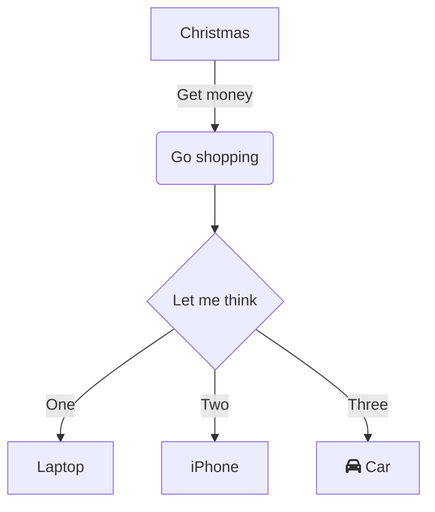
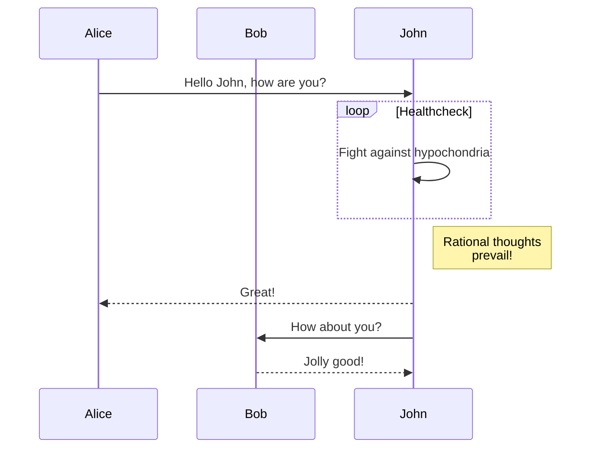
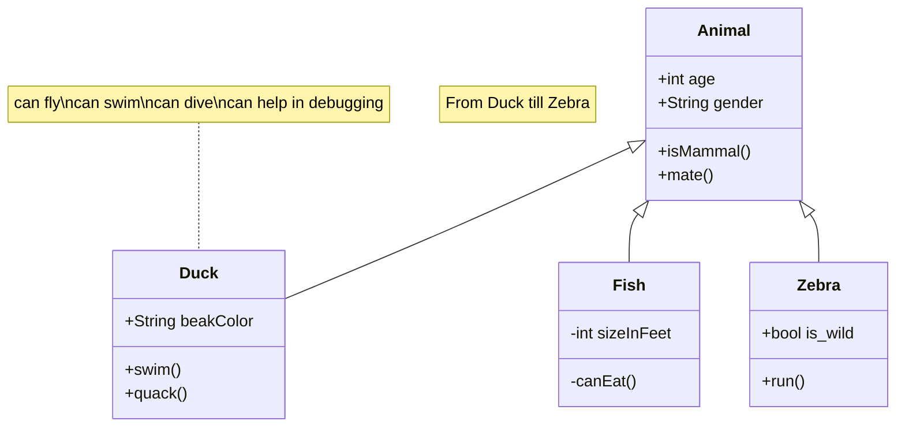
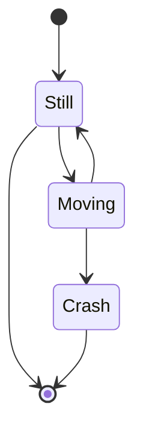
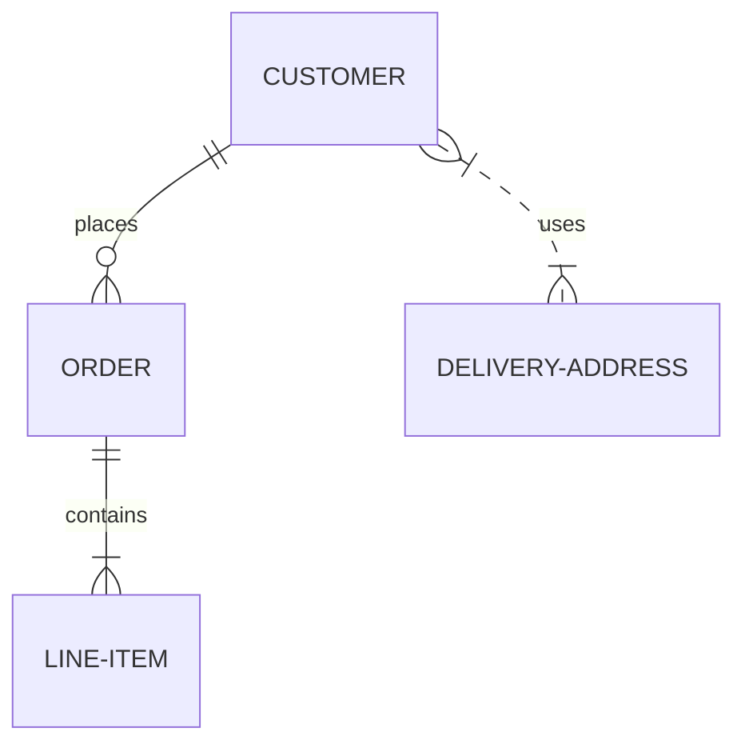
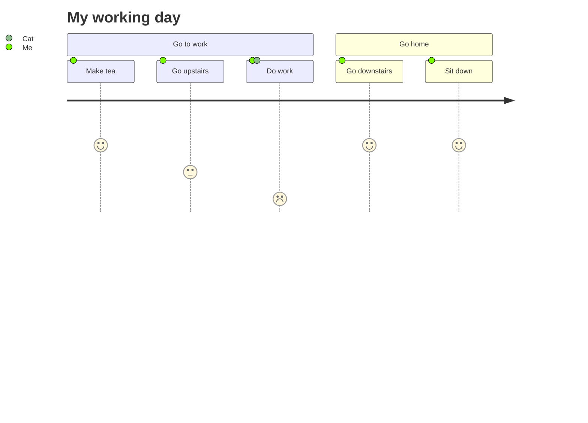
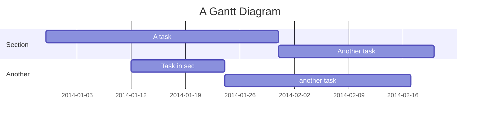
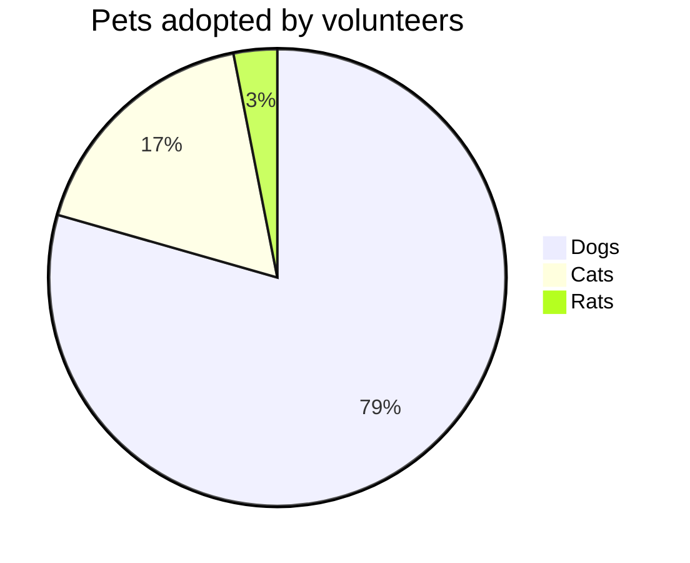

# Mermaid Diagram Examples

This file demonstrates various types of Mermaid diagrams supported by the BlockNote extension.

## Flowchart



## Sequence Diagram



## Class Diagram



## State Diagram



## Entity Relationship Diagram



## User Journey



## Gantt Chart



## Pie Chart



## Git Graph

```mermaid
gitgraph
    commit
    commit
    branch develop
    commit
    commit
    commit
    checkout main
    commit
    commit
```

## Instructions

1. **In Rich View**: These code blocks are automatically rendered as interactive diagrams
2. **To Edit**: Click the "Edit" button on any diagram
3. **To Insert New**: Click the 📊 button or use `Ctrl+Shift+M` / `Cmd+Shift+M`
4. **In Text View**: You'll see the raw mermaid markdown code